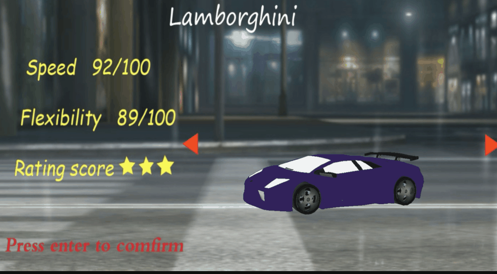
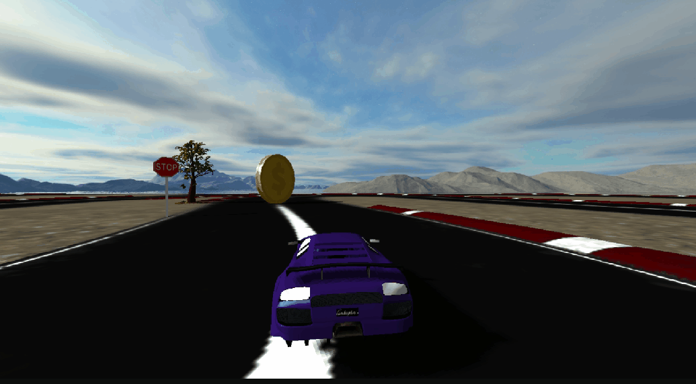
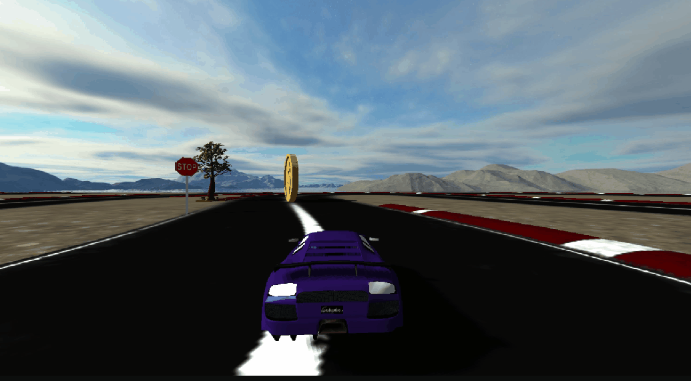
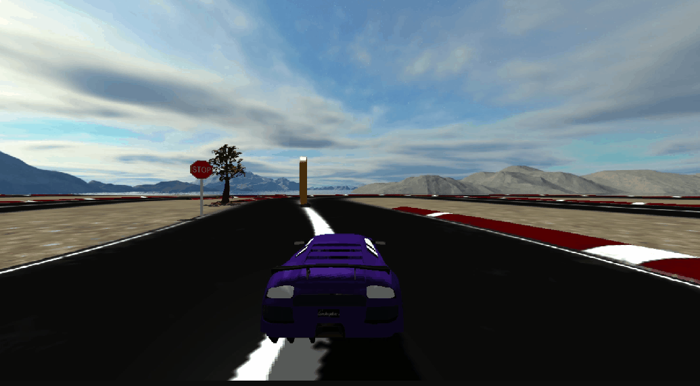

# 3D-Racing-Game
This is a racing game based on OpenGL.

## Introduction
In this racing game, players can control the car to move on the race track to hit as many gold coins as possible. 

## Features
- **Car Selection**
  
  Before the game starts, players can choose between the given car types to join the game.

  

- **Scene Changing**
  
  The scene can be changed by pressing the key M or N.

  

- **Camera Control**

  The position and direction of the camera can be changed via the keys W/A/S/D, where:

  - W: moving front
  - A: moving left
  - S: moving back
  - D: moving right
  
  

  Pressing key C can change the camera control mode:

  - W: turning left
  - D: turning right 

  

- **Glowing Effect**
  
  Pressing key Z can turn on the lights of the race track.

  

- **Multiple Rendering Modes**

  There are two different rendering modes: the wireframe mode and the normal mode, which are switched via key X.
   
  

- **Background Music**

  With the assist of *irrKLang* library, players can race with exciting music. 

- **Animation**

  Animation of objects in the game (in this case, the leaves) is implemented by loading a sequence of .obj files.

- **Screenshot**
  
  By pressing the key P, players can take screenshots and they are saved to the default folder (./RacingGames/screenshot)

## Install

- Platform: Windows 10
- Visual Studio: Visual Studio Community 2019

Download the project by a simple git clone:

~~~
git clone https://github.com/xinyu-evolutruster/3D-Racing-Game.git
~~~

and enjoy! :)
